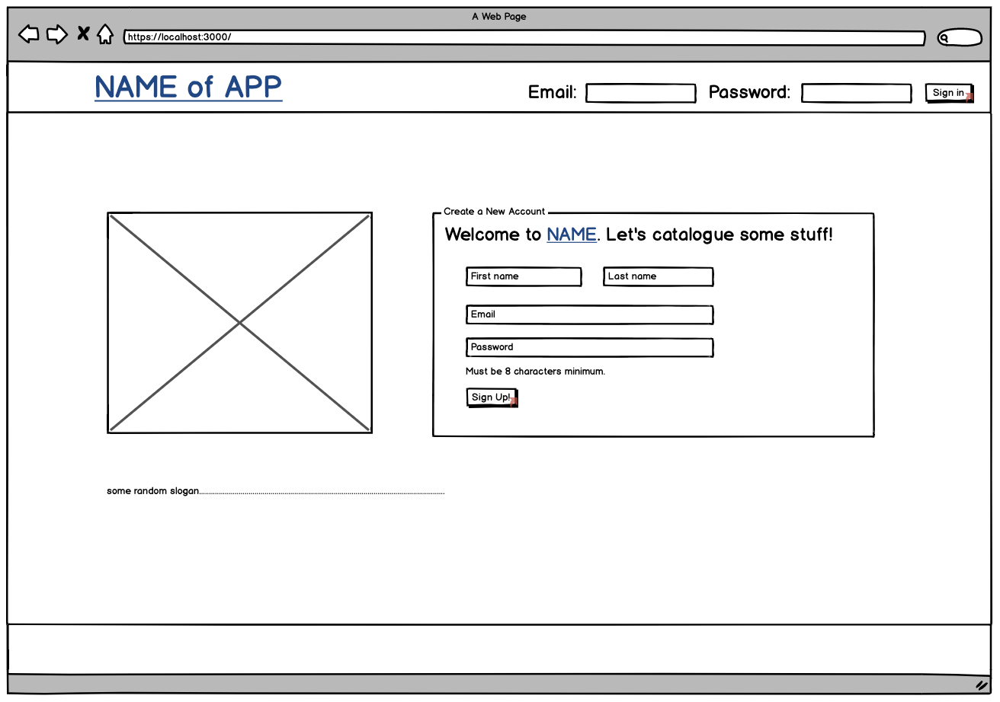
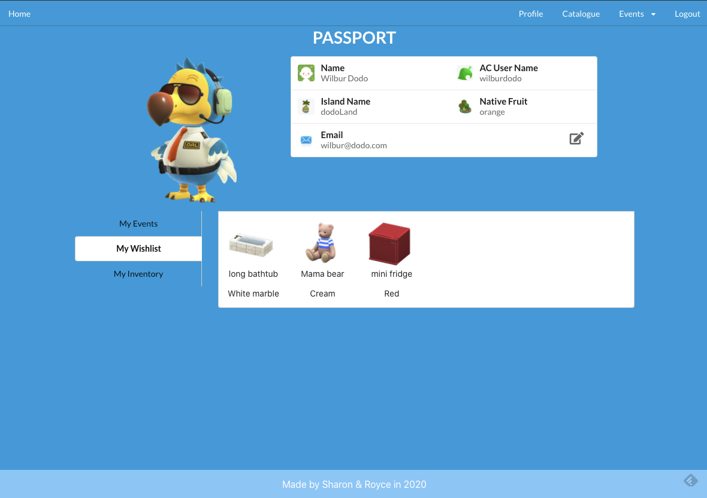
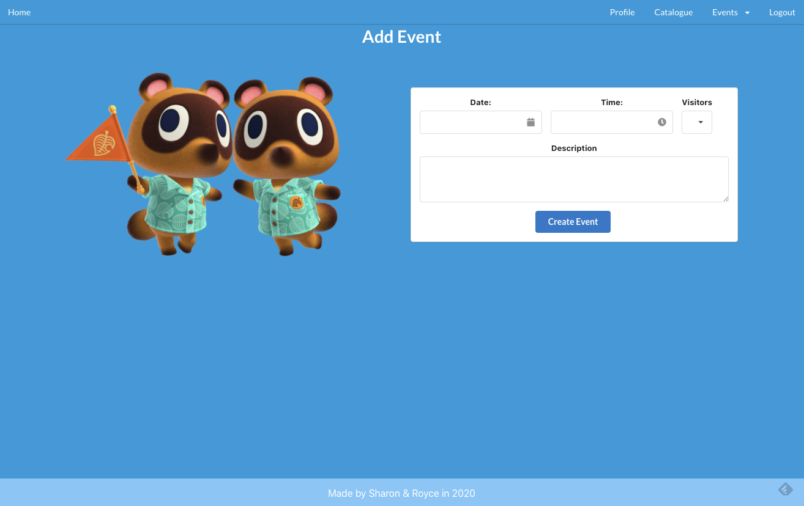
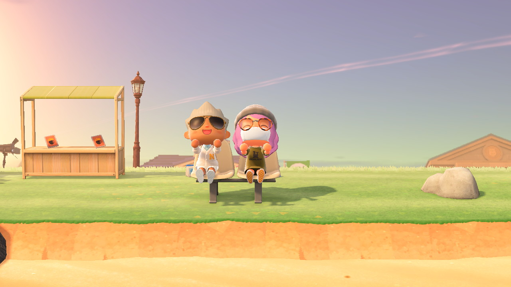

# Dodo Swap
MERN Animal Crossing New Horizons Catalogue Party App

## About
Dodo Swap is a community platform to connect members for the purpose of organizing cataloguing parties in Animal Crossing New Horizons created by [Sharon Lee](https://github.com/essleeung) and [Royce Ubando](https://github.com/royce-u). For the uninitiated, collecting all items in a series can be tricky and arduous task. With a catalogue party, one can invite other members to their island and collectively catalogue (pick up and drop items, so they can be ordered later in Nook's Cranny). The application is deployed [here](http://dodoswap.herokuapp.com/).

#### Technologies
This app was built with Typescript, MongoDB, Express, React and Node and utilizes JSON web tokens to authenticate users. Styling was done using React Semantic UI. The server side is deployed [here](http://dodoswap-server.herokuapp.com/).

---

## Development Approach

#### User Profile
As avid ACNH enthusiasts, we designed the the app with ourselves in mind and delved into the functionalities we hoped to see for an efficient and friendly user experience. Key features we were looking for: 

- Ability to see all items in the ACNH universe. *We specifically filtered out items that could not be catalogued to minimize confusion for users (Saharah, DIY crafting and Mom items).*
- Add items to your wishlist and inventory, so other members have an idea what to bring to your island.
- Create events on your island, limiting the number of visitors and providing additional information about entry criteria if members desire.
- Ability to see all events and join the ones you are interested in. 
- Ability to restrict visitors from joining if maximum visitors have been reached.

#### Design Approach
For the planning of this app, we relied on whiteboarding of the data schema, wireframing through Balsmiq and tracking features through Trello on a kanban board. This allowed us to test out user flow ahead of time and implement a site that is easy to navigate and use. 

**Image 1. Wireframe of site**

**Image 2. User profile**

**Image 3. Add event**

#### User schema

---

Special thanks to the [ACNH API](http://acnhapi.com/) team for putting together such great resources. We were able to leverage the [Google sheets](https://docs.google.com/spreadsheets/d/13d_LAJPlxMa_DubPTuirkIV4DERBMXbrWQsmSh8ReK4/edit#gid=1672309167) of all the items to seed our database.

We hope you enjoy this app and can gather all the items you are looking for!

